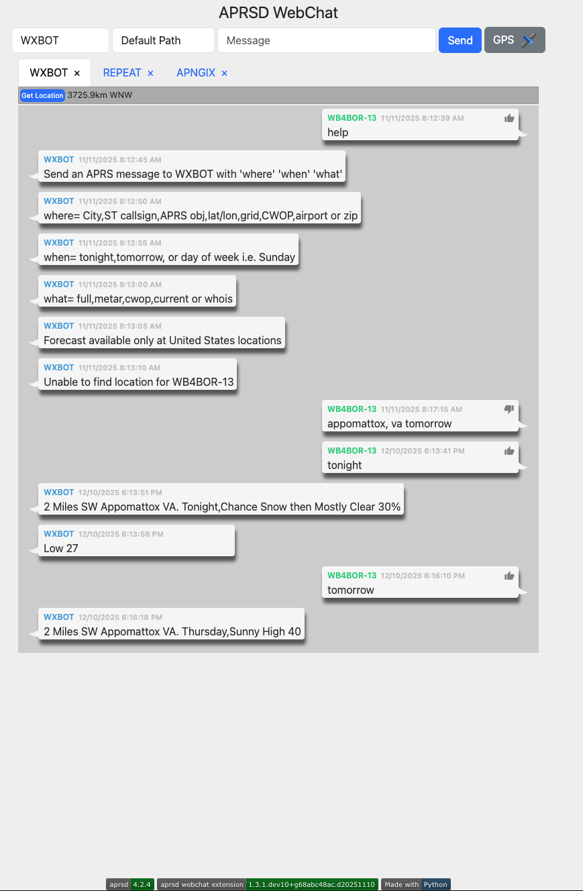

# APRSD Webchat

[](https://pypi.org/project/aprsd-webchat-extension/)
[](https://pypi.org/project/aprsd-webchat-extension/)
[](https://pypi.org/project/aprsd-webchat-extension)
[](https://opensource.org/licenses/Apache%20Software%20License%202.0)

[](https://aprsd-webchat-extension.readthedocs.io/)
[](https://github.com/hemna/aprsd-webchat-extension/actions?workflow=Tests)
[](https://codecov.io/gh/hemna/aprsd-webchat-extension)

[](https://github.com/pre-commit/pre-commit)



## Features

- This is the webchat extension for APRSD. This was removed from APRSD
  proper to help those installs that don't want/need the webchat
  capability and all of its requirements.

### Two UI Options

This branch includes **two web interfaces** served simultaneously:

| Route | UI | Description |
|---|---|---|
| `/` | Classic | jQuery/Bootstrap interface (original) |
| `/v2/` | Modern | React + Tailwind interface (new) |

The modern `/v2/` UI features:
- **Adaptive layout**: Sidebar channels on desktop, stacked navigation on mobile
- **Real-time messaging**: Chat bubbles with delivery status (spinner while waiting, thumbs-up on ACK)
- **Command palette**: Ctrl+K (desktop) or tap icon (mobile) for quick actions
- **GPS & beaconing**: Quick beacon button with APRS symbol sprite, GPS sheet for settings
- **Compass bearing**: Navigation arrow showing direction to other stations
- **Dark/light theme**: System-aware with manual toggle
- **Mobile-first**: Tappable status indicators, bottom sheets, touch-friendly controls
- **Error recovery**: Error boundary prevents blank screens, safe localStorage with auto-cleanup

## Requirements

- aprsd >= 4.2.4
- Python 3.9+

**No Node.js or npm required.** The React UI is pre-built and included in the
package. It works on all platforms including Raspberry Pi Zero.

**Fully offline.** The React UI (`/v2/`) has zero runtime internet dependencies.
All JavaScript, CSS, fonts (system fonts), and APRS symbol sprites are bundled
locally. No CDN, no Google Fonts, no external fetches. This is designed to run
on a Raspberry Pi Zero in the field with no internet connectivity. The only
external URLs are the GitHub links in the About dialog, which are optional
clickable links -- they don't affect functionality if unreachable.

## Installation

You can install *APRSD Webchat* via [pip](https://pip.pypa.io/) from
[PyPI](https://pypi.org/):

``` console
$ pip install aprsd-webchat-extension
```

Or using `uv`:

``` console
$ uv pip install aprsd-webchat-extension
```

### Installing from this branch

To install the experimental React UI branch directly from GitHub:

``` console
$ pip install git+https://github.com/hemna/aprsd-webchat-extension.git@004-react-ui-power-user
```

Or clone and install locally:

``` console
$ git clone -b 004-react-ui-power-user https://github.com/hemna/aprsd-webchat-extension.git
$ cd aprsd-webchat-extension
$ pip install .
```

After installation, start APRSD webchat as usual:

``` console
$ aprsd webchat
```

Then visit:
- `http://your-server:port/` for the classic UI
- `http://your-server:port/v2/` for the new React UI

## Configuration

Before running the webchat extension, you need to configure APRSD. The webchat extension uses
the same configuration file as APRSD. Generate a sample configuration file if you haven't already:

``` console
$ aprsd sample-config
```

This will create a configuration file at `~/.config/aprsd/aprsd.conf` (or `aprsd.yml`).

### Required Configuration

The webchat extension requires the following basic APRSD configuration:

1. **Callsign**: Your amateur radio callsign
2. **APRS-IS Network**: Connection to APRS-IS servers
3. **APRS Passcode**: Your APRS passcode (generate with `aprsd passcode YOURCALL`)

### Webchat-Specific Configuration

Add the following section to your APRSD configuration file to customize the webchat interface:

``` yaml
[aprsd_webchat_extension]
# IP address to listen on (default: 0.0.0.0 - all interfaces)
web_ip = 0.0.0.0

# Port to listen on (default: 8001)
web_port = 8001

# Latitude for GPS beacon button (optional)
# If not set, the GPS beacon button will be disabled
latitude = 37.7749

# Longitude for GPS beacon button (optional)
# If not set, the GPS beacon button will be disabled
longitude = -122.4194

# Beacon interval in seconds (default: 1800 = 30 minutes)
beacon_interval = 1800

# Disable URL request logging (default: False)
disable_url_request_logging = False
```

### Authentication

The webchat interface uses HTTP Basic Authentication. You'll need to set up authentication
credentials. The username and password are typically configured through your web server
or reverse proxy (if using one), or you can set them in your APRSD configuration.

## Usage

After installation and configuration, you can start the webchat server:

``` console
$ aprsd webchat
```

The webchat interface will be available at `http://localhost:8001` (or the IP/port you configured).

### Command-Line Options

``` console
$ aprsd webchat --help
```

Available options:

- `-p, --port PORT`: Override the web port from configuration
- `-f, --flush`: Flush out all old aged messages on disk
- `--loglevel LEVEL`: Set logging level (DEBUG, INFO, WARNING, ERROR)
- `--config-file FILE`: Specify a different configuration file
- `--quiet`: Disable console logging output

### Example: Running with Custom Port

``` console
$ aprsd webchat --port 9000 --loglevel INFO
```

This will start the webchat server on port 9000 instead of the default 8001.

### Accessing the Web Interface

Once the server is running:

1. Open your web browser
2. Navigate to `http://your-server-ip:8001/v2/` for the modern UI (or `/` for classic)
3. Enter your authentication credentials when prompted
4. You'll see the APRSD WebChat interface

### Features

- **Send Messages**: Send APRS messages to other stations
- **Receive Messages**: View incoming APRS messages in real-time
- **Message Status**: Track sent messages and their acknowledgments
- **GPS Beacon**: Send GPS beacons (if latitude/longitude are configured)
- **Station Locations**: View locations of stations you're communicating with
- **Real-time Updates**: Uses WebSockets for real-time message updates

### Integration with aprsd-gps-extension

If you have `aprsd-gps-extension` installed and enabled, the webchat interface will
automatically use GPS data from that extension instead of the static latitude/longitude
configuration. This enables dynamic GPS beaconing based on actual GPS coordinates.

## Development

### Prerequisites

- **Python 3.9+** and pip/uv (for the APRSD backend)
- **Node.js v18+** and npm (only for React UI development)

Node.js and npm are **only required if you are modifying the React UI**. End
users installing from pip or a release do not need them -- the React UI is
pre-built and included in the package.

### Setting Up for Development

``` console
$ git clone https://github.com/hemna/aprsd-webchat-extension.git
$ cd aprsd-webchat-extension
$ pip install -e ".[dev]"    # Install in editable mode
```

### Running in Development

Start the APRSD webchat backend:

``` console
$ aprsd webchat --loglevel DEBUG
```

Then open:
- `http://localhost:8001/` for the classic jQuery UI
- `http://localhost:8001/v2/` for the React UI

### React UI Development

The React source lives in `aprsd_webchat_extension/web/chat/react/`. If you
want to modify the React UI, you need Node.js and npm installed.

#### Install Node.js

On macOS:
``` console
$ brew install node
```

On Debian/Ubuntu (including Raspberry Pi OS):
``` console
$ curl -fsSL https://deb.nodesource.com/setup_20.x | sudo bash -
$ sudo apt-get install -y nodejs
```

Or use [nvm](https://github.com/nvm-sh/nvm) (works on any platform):
``` console
$ nvm install 20
$ nvm use 20
```

#### Development Workflow

1. **Install npm dependencies** (one time):

``` console
$ cd aprsd_webchat_extension/web/chat/react
$ npm install
```

2. **Start the Vite dev server** (hot reload on port 5173):

``` console
$ npm run dev
```

3. **In a separate terminal**, start APRSD:

``` console
$ aprsd webchat
```

4. **Open `http://localhost:5173`** in your browser. The Vite dev server
   proxies all API and WebSocket requests to Flask on port 8001. Changes to
   React components update instantly in the browser without a page refresh.

5. **When done**, build for production:

``` console
$ npm run build
```

This outputs optimized files to `dist/` which Flask serves at `/v2/`.
The `dist/` directory is committed to git so that end users don't need
npm to use the React UI.

#### Project Structure

```
aprsd_webchat_extension/web/chat/react/
├── src/
│   ├── main.tsx                    # React entry point
│   ├── App.tsx                     # Root component + Socket.IO init
│   ├── index.css                   # Tailwind CSS + theme variables
│   ├── components/
│   │   ├── ui/                     # Tooltip, ErrorBoundary, AboutDialog
│   │   ├── layout/                 # AppShell, StatusBar, ThemeProvider
│   │   ├── chat/                   # MessageBubble, ChatView, MessageInput, ChannelHeader
│   │   ├── channels/               # ChannelList, ChannelItem, Sidebar
│   │   ├── gps/                    # GPSSheet, SymbolPickerSheet, APRSSymbol
│   │   └── command-palette/        # CommandPalette
│   ├── hooks/                      # useSocket, useSocketEvents, useMediaQuery
│   ├── stores/                     # Zustand stores (messages, connection, gps, ui, aprs-thursday)
│   ├── lib/                        # Utilities (utils.ts, safe-storage.ts)
│   └── types/                      # TypeScript type definitions
├── dist/                           # Built output (committed to git)
├── vite.config.ts                  # Vite config with Flask proxy
├── tsconfig.json                   # TypeScript config
├── tailwind.config.ts              # Tailwind config
└── package.json                    # npm dependencies
```

#### Tech Stack

| Layer | Technology |
|---|---|
| Framework | React 19 + TypeScript |
| Build | Vite 6 |
| Styling | Tailwind CSS v4 |
| State | Zustand (5 stores with localStorage persistence) |
| Real-time | Socket.IO client |
| Icons | Lucide React + APRS symbol sprite sheets |

### Building a Release for PyPI

The release process builds the React UI, then packages everything into a
Python sdist/wheel that includes the pre-built frontend. End users install
with `pip install` and get both UIs working immediately -- no Node.js required
on the target machine.

#### Prerequisites for Building a Release

- Python 3.9+ with pip
- Node.js v18+ and npm (to build the React UI)
- `build` package (`pip install build`)
- `twine` package (`pip install twine`)

#### Step-by-Step Release Build

1. **Build the React UI**:

``` console
$ cd aprsd_webchat_extension/web/chat/react
$ npm install
$ npm run build
$ cd ../../../..
```

Verify the built files exist:
``` console
$ ls aprsd_webchat_extension/web/chat/react/dist/
assets/  index.html
```

2. **Run tests**:

``` console
$ tox -p all
```

3. **Build the Python package**:

``` console
$ python -m build
```

This creates both an sdist (`.tar.gz`) and wheel (`.whl`) in the `dist/`
directory. The React `dist/` files are included via the `package-data`
configuration in `pyproject.toml`.

4. **Verify the package contents** (check that React dist is included):

``` console
$ tar tzf dist/aprsd_webchat_extension-*.tar.gz | grep react/dist
```

You should see entries like:
```
aprsd_webchat_extension/web/chat/react/dist/index.html
aprsd_webchat_extension/web/chat/react/dist/assets/index-XXXXXXXX.js
aprsd_webchat_extension/web/chat/react/dist/assets/index-XXXXXXXX.css
```

5. **Upload to PyPI**:

``` console
$ twine check dist/*
$ twine upload dist/*
```

Or using the Makefile:
``` console
$ make build    # Runs tests + builds sdist/wheel
$ make upload   # Uploads to PyPI
```

#### Automated Build (Makefile)

The Makefile includes targets for building with the React UI:

``` console
$ make react-build    # Build React UI only
$ make build          # Run tests + build React UI + build Python package
$ make upload         # Upload to PyPI
```

#### Important Notes for Releases

- **Always rebuild the React UI** before creating a Python package. The
  `dist/` files committed to git may be stale if React source has changed.
- The React `dist/` is committed to git so that `pip install` from a git
  URL works without requiring npm on the target machine.
- The `pyproject.toml` `[tool.setuptools.package-data]` section ensures
  `web/chat/react/dist/**/*` is included in the wheel.
- On a Raspberry Pi Zero or other resource-constrained device, only
  `pip install` is needed. The pre-built JS/CSS bundles are ~90KB gzipped.

## Contributing

Contributions are very welcome. To learn more, see the [Contributor
Guide](CONTRIBUTING.rst).

## License

Distributed under the terms of the [Apache Software License 2.0
license](https://opensource.org/licenses/Apache%20Software%20License%202.0),
*APRSD Webchat* is free and open source software.

## Issues

If you encounter any problems, please [file an
issue](https://github.com/hemna/aprsd-webchat-extension/issues) along
with a detailed description.

## Credits

Author: **Walter A. Boring IV - WB4BOR**

This project was generated from [@hemna](https://github.com/hemna)'s
APRSD Extension Python Cookiecutter template.

### Activity


