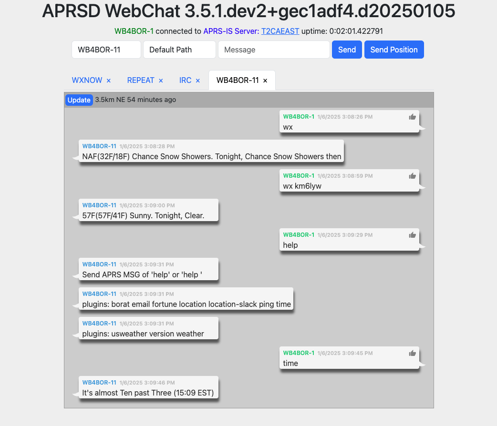

APRSD Webchat
=============

.. image:: https://img.shields.io/pypi/v/aprsd-webchat-extension.svg
   :target: https://pypi.org/project/aprsd-webchat-extension/
   :alt: PyPI

.. image:: https://img.shields.io/pypi/status/aprsd-webchat-extension.svg
   :target: https://pypi.org/project/aprsd-webchat-extension/
   :alt: Status

.. image:: https://img.shields.io/pypi/pyversions/aprsd-webchat-extension
   :target: https://pypi.org/project/aprsd-webchat-extension
   :alt: Python Version

.. image:: https://img.shields.io/pypi/l/aprsd-webchat-extension
   :target: https://opensource.org/licenses/Apache%20Software%20License%202.0
   :alt: License

.. image:: https://img.shields.io/readthedocs/aprsd-webchat-extension/latest.svg?label=Read%20the%20Docs
   :target: https://aprsd-webchat-extension.readthedocs.io/
   :alt: Read the documentation at https://aprsd-webchat-extension.readthedocs.io/

.. image:: https://github.com/hemna/aprsd-webchat-extension/workflows/Tests/badge.svg
   :target: https://github.com/hemna/aprsd-webchat-extension/actions?workflow=Tests
   :alt: Tests

.. image:: https://codecov.io/gh/hemna/aprsd-webchat-extension/branch/main/graph/badge.svg
   :target: https://codecov.io/gh/hemna/aprsd-webchat-extension
   :alt: Codecov

.. image:: https://img.shields.io/badge/pre--commit-enabled-brightgreen?logo=pre-commit&logoColor=white
   :target: https://github.com/pre-commit/pre-commit
   :alt: pre-commit

Features
--------

* This is the webchat extension for APRSD. This was removed from APRSD
  proper to help those installs that don\'t want/need the webchat
  capability and all of it\'s requirements.

Requirements
------------

* aprsd &gt;= 3.5.0

Installation
------------

You can install *APRSD Webchat* via `pip <https://pip.pypa.io/>`_ from
`PyPI <https://pypi.org/>`_\ :

.. code-block:: console

   $ pip install aprsd-webchat-extension

Or using ``uv``\ :

.. code-block:: console

   $ uv pip install aprsd-webchat-extension

Configuration
-------------

Before running the webchat extension, you need to configure APRSD. The webchat extension uses
the same configuration file as APRSD. Generate a sample configuration file if you haven't already:

.. code-block:: console

   $ aprsd sample-config

This will create a configuration file at ``~/.config/aprsd/aprsd.conf`` (or ``aprsd.yml``\ ).

Required Configuration
^^^^^^^^^^^^^^^^^^^^^^

The webchat extension requires the following basic APRSD configuration:

#. **Callsign**\ : Your amateur radio callsign
#. **APRS-IS Network**\ : Connection to APRS-IS servers
#. **APRS Passcode**\ : Your APRS passcode (generate with ``aprsd passcode YOURCALL``\ )

Webchat-Specific Configuration
^^^^^^^^^^^^^^^^^^^^^^^^^^^^^^

Add the following section to your APRSD configuration file to customize the webchat interface:

.. code-block:: yaml

   [aprsd_webchat_extension]
   # IP address to listen on (default: 0.0.0.0 - all interfaces)
   web_ip = 0.0.0.0

   # Port to listen on (default: 8001)
   web_port = 8001

   # Latitude for GPS beacon button (optional)
   # If not set, the GPS beacon button will be disabled
   latitude = 37.7749

   # Longitude for GPS beacon button (optional)
   # If not set, the GPS beacon button will be disabled
   longitude = -122.4194

   # Beacon interval in seconds (default: 1800 = 30 minutes)
   beacon_interval = 1800

   # Disable URL request logging (default: False)
   disable_url_request_logging = False

Authentication
^^^^^^^^^^^^^^

The webchat interface uses HTTP Basic Authentication. You'll need to set up authentication
credentials. The username and password are typically configured through your web server
or reverse proxy (if using one), or you can set them in your APRSD configuration.

Usage
-----

After installation and configuration, you can start the webchat server:

.. code-block:: console

   $ aprsd webchat

The webchat interface will be available at ``http://localhost:8001`` (or the IP/port you configured).

Command-Line Options
^^^^^^^^^^^^^^^^^^^^

.. code-block:: console

   $ aprsd webchat --help

Available options:

* ``-p, --port PORT``\ : Override the web port from configuration
* ``-f, --flush``\ : Flush out all old aged messages on disk
* ``--loglevel LEVEL``\ : Set logging level (DEBUG, INFO, WARNING, ERROR)
* ``--config-file FILE``\ : Specify a different configuration file
* ``--quiet``\ : Disable console logging output

Example: Running with Custom Port
^^^^^^^^^^^^^^^^^^^^^^^^^^^^^^^^^

.. code-block:: console

   $ aprsd webchat --port 9000 --loglevel INFO

This will start the webchat server on port 9000 instead of the default 8001.

Accessing the Web Interface
^^^^^^^^^^^^^^^^^^^^^^^^^^^

Once the server is running:

#. Open your web browser
#. Navigate to ``http://your-server-ip:8001`` (or your configured port)
#. Enter your authentication credentials when prompted
#. You'll see the APRSD WebChat interface

WebChat Features
^^^^^^^^^^^^^^^^

* **Send Messages**\ : Send APRS messages to other stations
* **Receive Messages**\ : View incoming APRS messages in real-time
* **Message Status**\ : Track sent messages and their acknowledgments
* **GPS Beacon**\ : Send GPS beacons (if latitude/longitude are configured)
* **Station Locations**\ : View locations of stations you're communicating with
* **Real-time Updates**\ : Uses WebSockets for real-time message updates

Integration with aprsd-gps-extension
^^^^^^^^^^^^^^^^^^^^^^^^^^^^^^^^^^^^

If you have ``aprsd-gps-extension`` installed and enabled, the webchat interface will
automatically use GPS data from that extension instead of the static latitude/longitude
configuration. This enables dynamic GPS beaconing based on actual GPS coordinates.

Contributing
------------

Contributions are very welcome. To learn more, see the `Contributor
Guide <CONTRIBUTING.rst>`_.

License
-------

Distributed under the terms of the `Apache Software License 2.0
license <https://opensource.org/licenses/Apache%20Software%20License%202.0>`_\ ,
*APRSD Webchat* is free and open source software.

Issues
------

If you encounter any problems, please `file an
issue <https://github.com/hemna/aprsd-webchat-extension/issues>`_ along
with a detailed description.

Credits
-------

This project was generated from `\@hemna <https://github.com/hemna>`_\ \'s
`APRSD Extension Python Cookiecutter <https://github.com/hemna/cookiecutter-aprsd-extension>`_ template.

Activity
--------

.. image:: https://repobeats.axiom.co/api/embed/ab02d395ffee8220385b7837d5883393aea7fee7.svg
   :target: https://repobeats.axiom.co/api/embed/ab02d395ffee8220385b7837d5883393aea7fee7.svg
   :alt: Alt

